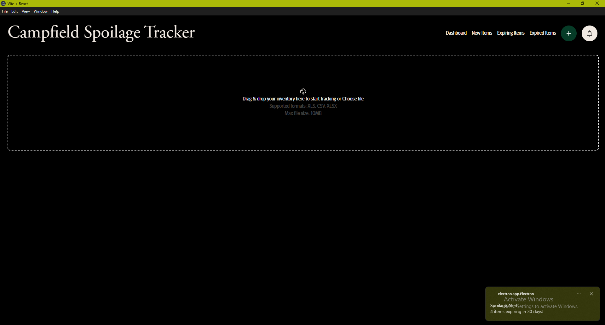

# Spoilage Tracker  
**An inventory management tool for tracking expiration dates efficiently.**  
## 🚀 Overview  
Spoilage Tracker helps users manage inventory by tracking expiration dates of multiple batches of items. The app provides email and desktop notifications to ensure nothing goes to waste.  
🎥 **[Watch the Demo](https://www.loom.com/share/04b921ce0eb24b8a9a40b6bdc2b21cf5?sid=4deb3968-bd1d-4e7b-9370-8154d6a18563)**  

---
## 📸 Screenshots
This was the initial MVP before I did any design work.


The dashboard view is under development. I have plans to add key indicators of change in item spoilage over time as well as some graphs to visually reflect that date.


Current view of recently uploaded inventory


Current view of the item details popup


Current view of the expired item section


*The intuitive dashboard makes tracking expirations simple and efficient.*
---
## 🛠 Tech Stack  
- **Frontend**: React, MUI Components  
- **Design**: Figma  
- **Backend**: Electron, NodeJS
- **Database**: SQLite  
---
## ✨ Features  
✅ Store multiple batches of expiration dates  
✅ Cross-platform support (Windows, Mac, Linux)  
✅ Email and desktop reminders for expiring items  
✅ Upcoming expiration alerts  
✅ Import items easily for bulk management (CSV, XSLX)

---
## 📦 Installation & Setup  
1. Clone the repository:  
   ```sh
   git clone https://github.com/yourusername/Spoilage-tracker.git
   cd Spoilage-tracker
   ```  
2. Install dependencies:  
   ```sh
   npm install
   ```  
3. Run the app in development mode:  
   ```sh
   npm run dev
   ```  
---
## 💡 Usage  
- Import inventory items and set expiration dates.  
- View upcoming expirations and expired items.  
- Receive email and desktop notifications for expiring items.  
- Manage multiple batches effortlessly.  
---
## 🔄 Project Status
**Version**: Patch 0.80

This project is currently under active development. New features and improvements are being added regularly.

---
## 📜 License  
This project is proprietary. All rights reserved.  

---
## 📬 Feedback & Support  
Have questions or suggestions? Feel free to reach out or open an issue.

Email: fkbokovi@gmail.com
